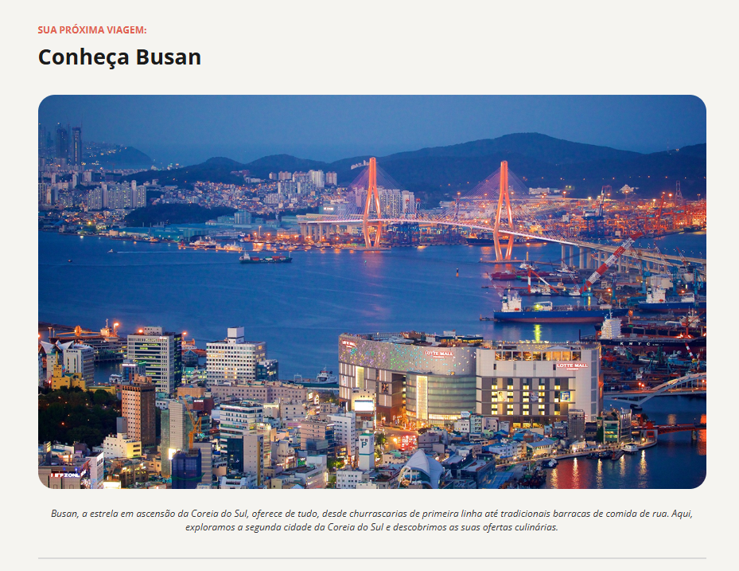
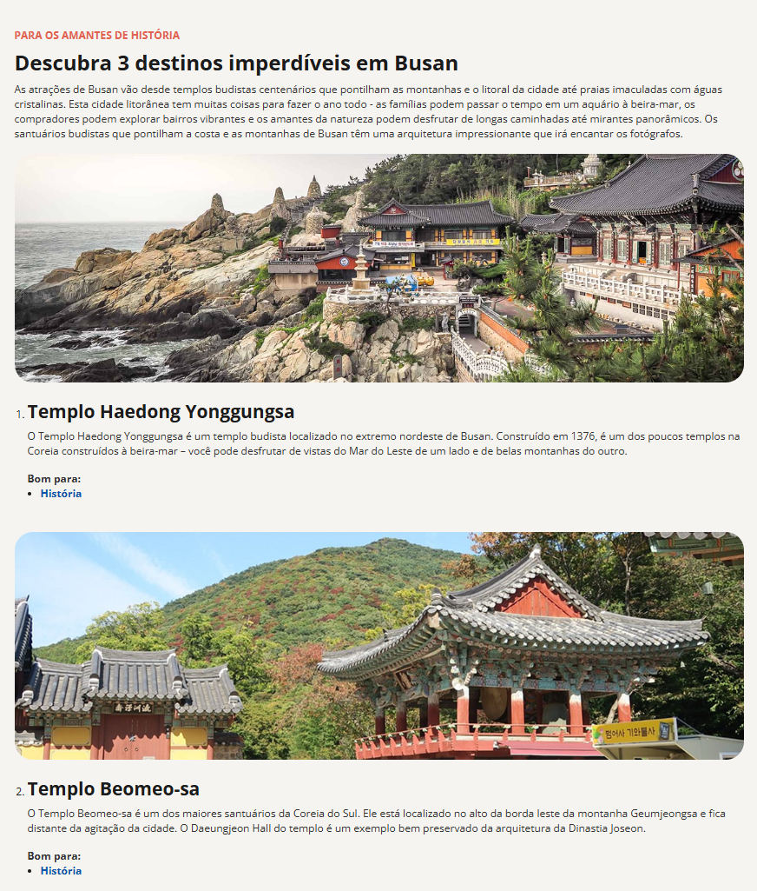
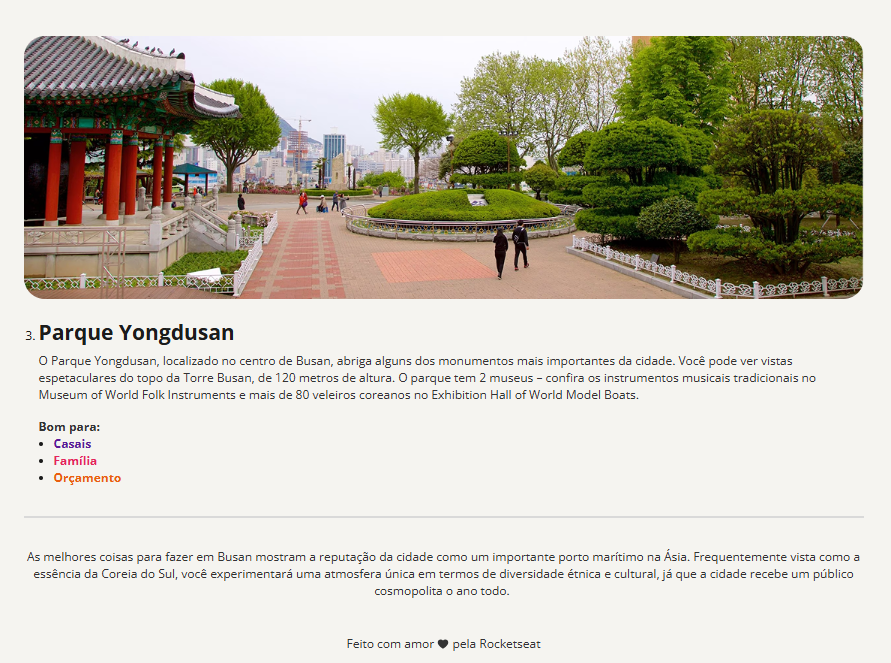

# Projeto: Local Turística

Este projeto é uma página web simples desenvolvida com  **HTML** e **CSS**, apresentando um local turístico. O objetivo é fornecer informações sobre o destino, destacando suas principais atrações e belezas visuais.

## 📌 Tecnologias Utilizadas

- **HTML5**
- **CSS3**

## 🌍 Sobre o Projeto

A página contém:

Uma seção de introdução sobre o local turístico;

Imagens destacando a beleza e os pontos principais do destino;

Informações relevantes sobre cultura, atrações e dicas para visitantes.

## 🖼️ Capturas de Tela

Aqui estão algumas imagens da página em funcionamento:





## 🚀 Como Executar o Projeto

Clone este repositório:
  ```sh
git clone https://github.com/nsbarros/local-turistico.git
```
Acesse a pasta do projeto:
 ```sh
cd local-turistico
```
Abra o arquivo index.html no navegador de sua escolha.

## 📜 Licença

Este projeto está licenciado sob a MIT License. Sinta-se à vontade para usá-lo e modificá-lo conforme necessário!

---
Feito com ❤️ por Nathan Barros (https://github.com/nsbarros)
